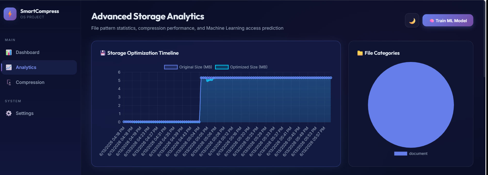
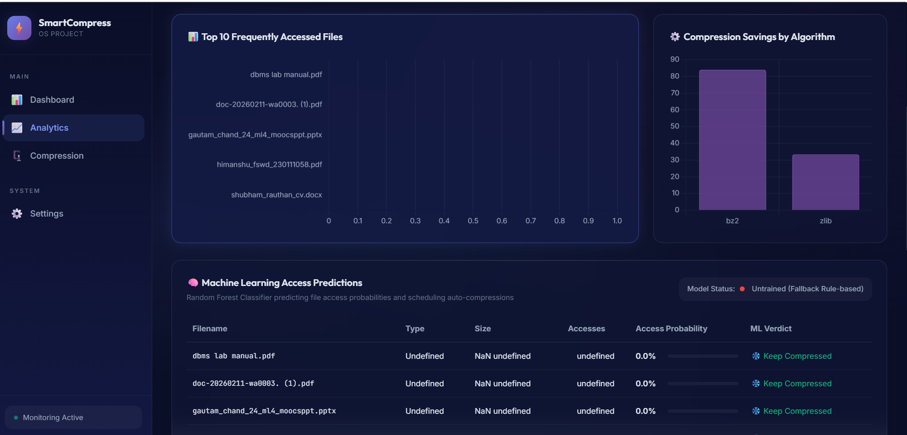
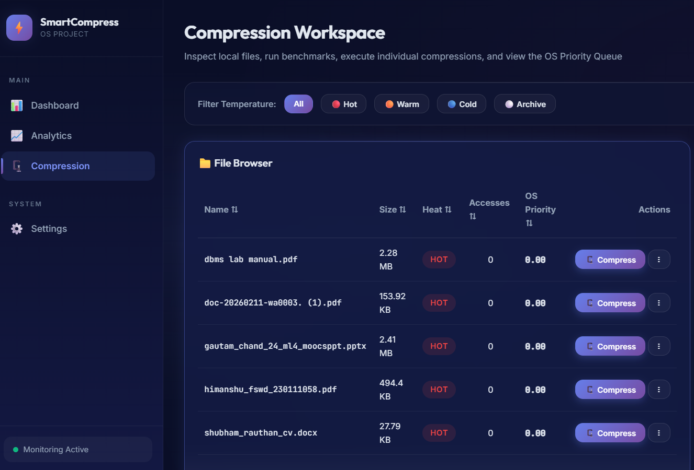

# OS Project – Intelligent Real-Time File Compression System

An advanced Operating Systems project that combines real-time file monitoring, adaptive compression, machine learning predictions, and storage analytics to optimize disk usage while maintaining fast access to frequently used files.

---

## Overview

SmartCompress continuously monitors file activity and intelligently decides which files should remain uncompressed and which files should be compressed to save storage space.

The system categorizes files into temperature zones:

* Hot Files
* Warm Files
* Cold Files
* Archive Files

Based on access patterns, machine learning predictions, and operating-system-inspired scheduling policies, SmartCompress automatically recommends and performs storage optimization actions.

---

## Key Features

### Real-Time File Monitoring

* Continuous folder monitoring
* File access tracking
* Metadata collection
* Activity history maintenance

### Intelligent Compression Engine

* Adaptive compression workflow
* Compression queue management
* Storage optimization scheduling
* File prioritization system

### Machine Learning Integration

* Access probability prediction
* File usage pattern analysis
* Compression recommendations
* Predictive storage management

### Advanced Analytics Dashboard

* Storage utilization analytics
* Compression performance tracking
* Access-frequency visualization
* Optimization timeline reports

### Recommendation System

The recommendation engine evaluates:

* File size
* Access frequency
* File temperature
* Predicted future usage

and suggests whether a file should:

* Remain uncompressed
* Be compressed immediately
* Be archived

---

## System Architecture

```text
File System
      │
      ▼
Folder Monitor
      │
      ▼
Metadata Tracker
      │
      ▼
Heat Classification Engine
      │
      ├── Hot
      ├── Warm
      ├── Cold
      └── Archive
      │
      ▼
Machine Learning Predictor
      │
      ▼
Recommendation Engine
      │
      ▼
Compression Scheduler
      │
      ▼
Compression Engine
      │
      ▼
Analytics Dashboard
```

---

## Screenshots

### Storage Optimizer Dashboard


---

### Smart Compression Recommendations


---

### Advanced Analytics



---

### Machine Learning Access Predictions



---

### Compression Workspace



---

## Technologies Used

### Backend

* Python
* Flask

### Frontend

* HTML5
* CSS3
* JavaScript

### Data Processing

* File Metadata Analysis
* Access Pattern Tracking
* Compression Scheduling

### Machine Learning

* Random Forest Based Prediction
* File Access Probability Estimation

### Storage Optimization

* Huffman Encoding
* zlib Compression
* bz2 Compression

---

## Project Structure

```text
OS_PROJECT/
│
├── api/
├── compressor/
├── ml/
├── monitor/
├── static/
├── templates/
│
├── app.py
├── config.py
├── database.py
├── requirements.txt
└── README.md
```

---

## Installation

```bash
git clone https://github.com/GautamChand/OS_PROJECT.git

cd OS_PROJECT

pip install -r requirements.txt

python app.py
```

---

## Future Enhancements

* Deep Learning Based Access Prediction
* Automatic Background Compression
* Multi-Drive Optimization
* Cloud Storage Integration
* Distributed Compression Framework
* Reinforcement Learning Scheduling

---

## Author

**Gautam Chand**

Computer Science Student

Focused on Operating Systems, Machine Learning, Storage Optimization, and Software Engineering.

